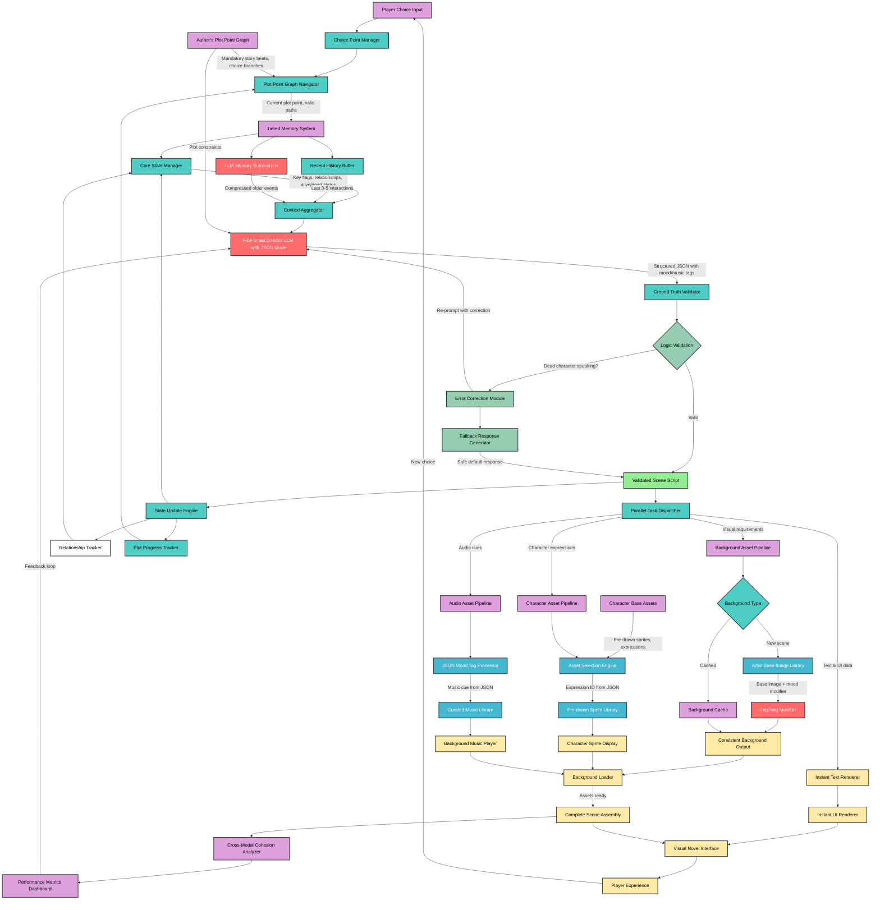

Parent notes: [[NLP]]
Hashtags:


# What are Visual Novels
![[Pasted image 20250820013011.png]]
![[Pasted image 20250820013045.png]]
- Text-box
- Character Sprite 
- Background art
- Sound effects (rain, footsteps)
- Background music
- Branching narrative based on choices


# Preliminary Idea
- Traditional visual novels/RPGs have a few predefined paths, with little value for replayability.
- Sandbox games like Minecraft have replayability value due to variation.
- I propose we create  a dynamic and personalized visual novel which follows a broad predefined narrative (Ex: Character X dies by the end of the chapter), while also allowing room for personalization. This would make the gameplay more immersive while also allowing the author to create the broad storyline and hopefully keep the VN entertaining as compared to a purely AI generated storyline.
- An LLM will be trained on a database of Visual novels or Visual novel like script, the database has to be created from scratch, which is the most challenging part.
- The response of the LLM has to be 'controlled', the responses should reflect the broad script and characterization as defined by the author while also allowing the freedom of choice to the player in some places.
- The initial  version of the VN would be to display predefined sprites (happy/sad face) by identifying the mood of the sentence.
- In later iterations if possible, we would add the ability to generate images, relevant to the generated text using a VLM.
- This VN would allow AI and creatives to work collaboratively rather than a purely LLM driven work.
- Some other potential features are:
	- Cuing music from a list of predefined tracks based of the mood of the scene.
	- Cuing sound-effects based on the scene (Vase falling, footsteps, etc.)
	- A relationship bar influencing closeness of the player to the characters which automatically changes in a somewhat predictable way based on player choices.
	- Adding memory to the characters so they remember their previous interactions with the player and bring it up in the future.
- The created VN will be evaluated based on:
	- Diversity of choices
	- Relevance of narrative
	- Cohesion between text and assets (images/sounds)
	- Delays in generation
- The above VN pipeline may also help people create VNs of their favorite works from scratch themselves just using the script of the original work.
- We will work in the genre of horror for this project, it can be extended to other genres as well.
- Add an asset cache
# Dataset

- Horror stories dataset: [link](https://www.kaggle.com/datasets/thomaskonstantin/3500-popular-creepypastas/data)
- Horror movie scripts: [link](https://www.studiobinder.com/blog/horror-movie-scripts/)


# Proposed pipelines

## Pipeline A: The Director-Parser Model

This pipeline is based on your first idea of generating a complete, structured script for each scene, which is then parsed to control various game elements. Think of the core LLM as a "movie director" that writes a detailed script, and a "parser" as the assistant director that tells each department (visuals, sound, text) what to do.

Script to json conversion can be done using an artificially generated dataset or a rule based template filling model.

### **Workflow** 

1.  **Player Input & State:** The game engine captures the player's choice and the current game state (e.g., relationship values, plot flags, character memory).
2.  **Core Narrative LLM (The Director):** This information, along with the author's broad narrative outline, is fed to a fine-tuned LLM. The LLM's sole task is to generate a structured output for the next beat of the story, formatted in a predefined way (like JSON or a custom markup).
      * **Example Output (JSON):**
        ```json
        {
          "scene_id": "CH1_MEETING_PROFESSOR_02",
          "character": "Professor Ned",
          "dialogue": "Ned, you’re late.",
          "expression": "disappointed",
          "background": {
            "description": "A university professor's office, cluttered with books. A digital clock on the wall reads 10:32.",
            "prompt_keywords": "anime style, professor office, cluttered bookshelves, afternoon light, digital clock"
          },
          "sound_effect": "none",
          "music_cue": "tense_theme_1"
        }
        ```
3.  **Parser:** A non-AI component in your game engine reads this structured output. It's a simple rule-based system.
4.  **Asset Generation & Execution:** The parser dispatches instructions to the relevant sub-modules:
      * The `"dialogue"` and `"character"` are sent to the **UI Text Box**.
      * The `"expression"` is used to select a pre-drawn **Character Sprite** (e.g., `ned_disappointed.png`).
      * The `"background.prompt_keywords"` are sent to a **VLM** (like Stable Diffusion) to generate the background image.
      * The `"music_cue"` is sent to the **Audio Engine** to play the correct track.

-----

### **Pros & Cons**

  * **Pros:**

      *  **Modularity & Control:** Highly controllable. You can swap out the image generation model or the audio engine without changing the core LLM.
      *  **Debugging:** Very easy to debug. If an image is wrong, you can inspect the exact structured script and prompt that was generated, isolating the problem to either the Director LLM or the VLM.
      *  **Cohesion:** Since one LLM generates the entire scene beat at once, the dialogue, character expression, and background description are inherently linked and cohesive.

  * **Cons:**

      *  **Latency:** Can feel slow. The player has to wait for the LLM to generate the entire script block *and then* for the VLM to generate the image before the scene can be displayed.
      *  **Rigidity:** The LLM must be meticulously fine-tuned to *always* adhere to the strict output format. A 
      * single formatting error could break the parser.


-----




# Problems and solutions to above pipeline

### Problems


### ## Architectural and Conceptual Challenges

1.  **Narrative Scaffolding and Control:** The diagram shows an "Author's Narrative Outline" feeding into the LLM. This is a critical but abstract concept. **The primary problem is how to enforce this outline effectively.**
    * **Is it a prompt?** If the outline is just part of a massive prompt, the LLM might eventually ignore it or "hallucinate" plot points that deviate significantly, breaking the author's intended story (e.g., killing a character who is vital for Chapter 3).
    * **Is it a set of rules?** Hard-coding rules is brittle and defeats the purpose of using a flexible LLM.
    * **Is it through fine-tuning?** This would require a massive dataset of stories that follow similar outlines, which doesn't exist.
    Controlling a creative LLM to stay within broad narrative "rails" without making it feel rigid is an extremely difficult balancing act.

2.  **State Management and Context Window:** The "Game State Manager" tracks choices, relationships, and memory. This entire state must be fed to the LLM for every single generation to ensure continuity.
    * **Context Length:** LLM context windows are finite. As a playthrough continues, the history of choices, dialogues, and relationship scores will grow. Eventually, this will exceed the context window, forcing you to truncate or summarize the history, which can lead to the model forgetting key past events.
    * **Latency:** Pushing a large JSON object representing the entire game state into the prompt for every turn will significantly increase processing time and API costs.

3.  **Semantic vs. Syntactic Validation:** Your diagram includes a `Valid Script?` check. This can easily check for syntactic errors (e.g., malformed JSON). However, it **cannot check for semantic or logical errors**.
    * **Example:** The LLM might generate a perfectly formatted JSON script where a character who is supposed to be in another country suddenly appears, or a dead character starts talking. The "Error validation" module has no way of knowing this is a narrative error, leading to a break in story logic.

---

### ## Technical and Implementation Hurdles

1.  **Asset Consistency (The "Professor Ned" Problem):** You've noted issues with character expressions, but a deeper problem is **character identity**. Generating a background with "Professor Ned" in it will produce a different-looking Professor Ned every single time.
    * **Solution Complexity:** Achieving visual consistency requires advanced techniques like training custom LoRAs or using IP-Adapters/ControlNets for each character, which dramatically increases the complexity of the image generation pipeline. This is also true for key locations. You need the "professor's office" to look the same in scene 5 as it did in scene 1.

2.  **Output Formatting Brittleness:** As you correctly identified in the cons for Pipeline A, forcing an LLM to consistently output a strict, complex JSON structure is notoriously unreliable.
    * The model might omit fields, add extra ones, or break the JSON syntax, causing your `Scene Script Parser` to fail. Relying on an "Error validation" loop to fix this can lead to the system getting stuck, repeatedly asking for a valid format and increasing latency for the player.

3.  **The "Vibe" Mismatch (Cohesion Risk):** There is a significant risk of a mismatch between the generated assets.
    * **Text to Emotion:** The `Sentiment/Emotion Identification` module is a potential point of failure. Sarcasm, subtext, or complex emotions are hard to classify into simple tags like "happy" or "sad." An LLM might generate melancholic dialogue, but the classifier could misinterpret it and select a cheerful sprite.
    * **Text to Image:** The LLM might generate the dialogue, *"The office felt cold and unwelcoming,"* but the prompt it generates for the VLM might be a generic *"anime professor's office, afternoon light,"* leading to a bright, cheerful image that directly contradicts the narrative tone. Ensuring cohesion across modalities is a major challenge. 
---

### ## Data and Training Challenges

1.  **Dataset Heterogeneity:** Your identified datasets (Japanese VN scripts, Creepypastas, movie scripts) are excellent sources of narrative but are formatted completely differently.
    * **The core problem is creating a unified training dataset.** You would need a massive data cleaning and structuring effort to convert all these varied sources into your target JSON format for fine-tuning. This pre-processing step could be as complex as building the model itself. A rule-based approach might be too simple, and using another LLM to do the conversion will be expensive and error-prone.

---

### ## User Experience (UX) Nightmares

1.  **Crippling Latency:** This is the most immediate and dangerous problem for the project's viability.
    * **Calculation:** Let's assume a fast LLM response (5 seconds) and a fast image generation (10 seconds with a model like SDXL-Turbo). A player makes a choice and has to wait **at least 15 seconds** staring at a loading screen before the next line of dialogue and scene appears. This is far too long for an interactive story and will likely make the game unplayable. Your estimate of 30s for Stable Diffusion 1.5 would be a complete non-starter.
    * **Pipeline B's Latency:** While Pipeline B aims to hide latency by generating the image in the background, this only works if the image is not essential for the text that is currently on screen. If the dialogue refers to something specific in the new background, you still have to wait.

2.  **The Illusion of Agency:** You aim to give players freedom within a broad plot. The risk is that this freedom is illusory. If the "Author's Narrative Outline" is too strong, the LLM will gently guide the player back to the main plot regardless of their choices. Players are very adept at noticing when their choices don't have a meaningful impact on the story, which can be more frustrating than a completely linear narrative.

## Solutions


### 1\. Enforcing the Author's Narrative Outline

Instead of feeding the LLM a vague "outline" and hoping it follows, implement a **Plot Point Graph** system.

**Proposed Change:**

Your authoring tool won't be a single document but a graph (or a list) of mandatory "Plot Points." The LLM's job is not to decide the entire story, but to generate the **connective tissue** between these points.

**How It Works:**

1.  **Author defines the structure:**

      * `Plot Point 1`: Player arrives at the old mansion. Mood is `Eerie`.
      * `Plot Point 2`: Player finds a locked diary in the study. Mood is `Intriguing`.
      * `Plot Point 3`: The power suddenly goes out. Mood is `Tense`.
      * **`Choice Point A`**: Player hears a sound from the basement. The author flags this as a moment for player choice.

2.  **State-Aware Prompting:** The `Game State Manager` tracks which plot point was just completed. The prompt to the LLM becomes highly specific and constrained.

      * **Example Prompt:** "You are writing a scene for a horror visual novel. The player has just completed 'Plot Point 2: Found locked diary'. The next mandatory event is 'Plot Point 3: Power goes out'. Generate 3-5 lines of descriptive text and/or character inner monologue that builds suspense and bridges these two events. The scene should transition from an `Intriguing` mood to a `Tense` one. **Do not trigger the power outage yet.**"

**Why This Is Better:**

  * **Control:** This gives the author absolute control over the narrative spine. The story *will* hit the beats you design.
  * **Reliability:** It's a much simpler task for the LLM to write a short, constrained transition than an entire open-ended chapter, dramatically reducing the chance of it going off the rails.
  * **Cohesion:** You can explicitly dictate the mood and key elements for each segment, ensuring the generated content aligns with your vision.

-----

### 2\. Injecting Player Choices

Do not rely on the LLM, which is trained on linear scripts, to spontaneously decide when to offer a choice. This is a game design decision, not a generation one.

**Proposed Change:**

Integrate choice creation directly into your **Plot Point Graph**. The author, not the LLM, decides where choices occur.

**How It Works:**

1.  **Author Flags Choice Points:** As seen above, the author explicitly marks `Choice Point A` in the narrative flow.
2.  **Two-Phase Generation:** When the game reaches a `Choice Point`:
      * **Phase 1 (Setup Generation):** The system first prompts the LLM to write the *setup* for the choice.
          * **Example Prompt:** "The player has just experienced a power outage. Write a single, tense paragraph describing the sudden darkness and the character hearing a faint scratching sound coming from the basement door. End the paragraph right as the character must decide what to do."
      * **Phase 2 (Choice Text):** The game engine then displays the choice options. These options can be:
          * **Author-Written (Recommended):** The author pre-writes the choices (e.g., "Go investigate the noise," "Barricade the door and hide"). This guarantees meaningful options.
          * **LLM-Generated (Advanced):** You can prompt the LLM to generate the choices based on the setup. "Based on the previous paragraph, offer two distinct choices for the player: one brave, one cowardly."

**Why This Is Better:**

  * **Meaningful Agency:** The author ensures that choices appear at dramatically appropriate moments and lead to interesting, pre-designed branches.
  * **Avoids Randomness:** Prevents the LLM from offering trivial or nonsensical choices (e.g., "Check your phone for signal" vs. "Think about what you had for breakfast").

-----

### 3\. Background Image Generation (Consistency)

Your idea is excellent and is the correct approach. Do not use text-to-image (txt2img) for every scene. Use a base image combined with **image-to-image (img2img)**.

**Proposed Change:**

1.  **Create Base Assets:** For each key location (e.g., "Study," "Kitchen"), provide one clean, well-lit, neutral base image.
2.  **Generate Variations:** The LLM's JSON output won't contain a full prompt, but rather **modifiers** for the base image.
      * **Example JSON Output:**
        ```json
        {
          "background_base": "study_day.png",
          "background_modifiers": "night, only a single candle is lit on the desk, deep shadows in the corners, eerie green glow from the window",
          "fx": "rain_on_window"
        }
        ```
3.  **Use `img2img`:** Your image generation pipeline will take `study_day.png` as an input image, use the `background_modifiers` as the prompt, and run it through Stable Diffusion with a low to medium denoising strength (e.g., 0.4 - 0.6). This will preserve the room's architecture while changing the lighting and atmosphere.

**Why This Is Better:**

  * **Visual Consistency:** The study will always look like the study. The layout, furniture, and key objects will remain the same.
  * **Faster & Cheaper:** `img2img` is often faster than `txt2img` from pure noise.
  * **More Controllable:** You get far more predictable results.

-----

### 4\. Character Image Generation (Consistency)

Your instinct is correct, but the technology to dynamically add expressions to a static sprite via a general LLM/VLM is not yet reliable for production. A far more robust solution is the standard industry practice.

**Proposed Change:**

Use the LLM to **select** a pre-drawn expression, not to generate it.

**How It Works:**

1.  **Create a Sprite Sheet:** Your artist draws one base character sprite with several different expression layers (e.g., `character_jane_base.png`, `mouth_happy.png`, `eyes_angry.png`) or, more simply, full sprites for each emotion (`jane_happy.png`, `jane_angry.png`).
2.  **LLM Outputs a Tag:** The LLM's JSON output for dialogue will include an expression tag.
      * **Example JSON Output:**
        ```json
        {
          "character": "Jane",
          "dialogue": "I told you not to open that book!",
          "expression": "angry"
        }
        ```
3.  **Simple Lookup:** The `Character Sprite Display` module is a simple dictionary or switch statement. It receives "Jane" and "angry" and displays the pre-made `jane_angry.png`.

**Why This Is Better:**

  * **100% Reliability:** You get perfect, artist-intended expressions every time. No warped faces or uncanny valley artifacts.
  * **Zero Latency:** Displaying a pre-made image is instantaneous.
  * **Artistic Control:** It preserves the artistic style perfectly.

-----

### 5\. Mood Identification and Asset Cueing

Your idea of a mood module is good, but making it a *separate* module that analyzes the text *after* generation is a major point of failure. It can easily misinterpret sarcasm, subtext, or complex tones.

**Proposed Change:**

Make mood and asset cueing an **integral part of the LLM's generation task**.

**How It Works:**

1.  **Enrich Your Training Data:** When you fine-tune your model on horror scripts, pre-process the data to include the very tags you want the LLM to generate. You might need another LLM pass or manual annotation to create this data.

2.  **Modify the Target Output:** Train the LLM to output a complete JSON object that includes not just dialogue, but all the associated cues.

      * **Example Target JSON for Fine-tuning:**
        ```json
        {
          "scene_mood": "Rising Tension",
          "character": "Mark",
          "dialogue": "Did you hear that? It sounded like it came from upstairs...",
          "expression": "fearful",
          "music_cue": "play_suspense_theme_2",
          "sound_effect_cue": "distant_floorboard_creak.wav"
        }
        ```

**Why This Is Better:**

  * **Inherent Cohesion:** The LLM that generates the fearful dialogue also generates the "fearful" expression tag and the "suspense" music cue. The tone is inherently linked across all modalities because it comes from a single contextual understanding. This virtually eliminates the "vibe mismatch" problem.
  * **Simpler Architecture:** You remove the need for a separate, potentially inaccurate sentiment analysis model. Your core LLM becomes a "multimodal director" that outputs a complete set of instructions for the game engine.
- Directly generate the json by augmenting the training data


### \#\# 1. State Management and Context Window

The key is to stop sending the entire game history with every request. Instead, implement a **Tiered Memory System** to keep the context lean and effective.

Your prompt should be constructed from three components:

1.  **Core State (Ground Truth):** A compact, essential JSON object that is *always* included. This is the non-negotiable state of the world.

      * **Example:**
        ```json
        {
          "relationships": { "Jane": 75, "Mark": 30 },
          "inventory": ["rusty_key", "locked_diary"],
          "plot_flags": { "power_outage": true, "has_read_diary": false },
          "character_status": { "Jane": "alive", "Mark": "alive", "Dr_Evans": "deceased" }
        }
        ```

2.  **Recent History (Short-Term Memory):** The full JSON objects from the last **3-5 turns**. This provides immediate conversational context, ensuring the LLM remembers what was just said and done.

3.  **Summarized Memory (Long-Term Memory):** This is the game-changer. After key narrative beats or "chapters," a background process sends the recent history to the LLM with a specific task: summarization.

      * **Prompt for Summarizer:** "Condense the following events into key memories for the player. Focus on major decisions, discoveries, and relationship shifts."
      * **Example Summary:**
          * *Player discovered a locked diary in the study but chose to hide it from Mark, increasing his suspicion.*
          * *Player worked with Jane to barricade the door during the power outage, strengthening their trust.*
          * *A key memory: The strange symbol seen in Dr. Evans's notes matches the one on the diary.*
            This clean, summarized text replaces the older raw history in future prompts.

**Result:** This approach keeps your context window from overflowing, drastically cuts down on the tokens used per call (reducing latency and cost), and prevents the LLM from forgetting crucial long-term events.

-----

### \#\# 2. Semantic vs. Syntactic Validation

You cannot rely on the LLM to be the sole source of truth. The solution is to use your **Core State** object as an authoritative "Ground Truth" and make your game engine the final arbiter.

**The proposed workflow:**

1.  The Director LLM generates a JSON output, which is treated as a **"proposal."**
      * *LLM Proposal:* `{ "character": "Dr_Evans", "dialogue": "You should not have come back." }`
2.  Before executing, your `Scene Script Parser` validates the proposal against the **Core State**.
3.  The parser checks `core_state.character_status["Dr_Evans"]`. It sees the value is `"deceased"`.
4.  **Validation Fails.** The system now intervenes. It rejects the LLM's proposal and automatically sends a new request with a correction.
      * **Corrective Re-prompt:** "Regenerate the last response. **Important Correction:** The character Dr. Evans is deceased and cannot speak. The scene should reflect this fact, perhaps through a memory, a note, or another character mentioning him."

**Result:** This creates a self-healing system. It prevents logical paradoxes (like dead characters speaking) by enforcing the game's fundamental rules, forcing the LLM to be creative within the established constraints of the story.

-----

### \#\# 3. Output Formatting Brittleness

Forcing an LLM to follow a format is difficult, so use the tools designed for it. The solution is a combination of **forcing JSON Mode** and implementing a **robust parsing/repair loop**.

1.  **Use JSON Mode:** Modern LLM APIs (including Gemini) have a feature often called "JSON Mode" or "Structured Output." When you enable this and provide your JSON schema, the API **guarantees** the output string will be syntactically valid JSON. This instantly solves most of your parsing failures.
2.  **Implement a Pydantic Repair Loop:** To handle cases where the JSON is valid but misses a required field, use a library like Pydantic in Python.
      * Define your "Golden" JSON structure as a Pydantic model.
      * Wrap your API call in a `try/except` block with a limited number of retries (e.g., 3).
      * If Pydantic fails to validate the JSON because a field is missing, the `except` block catches the specific error message.
      * Your code then automatically re-prompts the LLM, including the faulty JSON and the precise error message from Pydantic (e.g., "Error: Field `expression` is required.").

**Result:** This two-pronged approach makes your system incredibly resilient. JSON Mode ensures the structure is always correct, and the repair loop cleans up any content errors, preventing your game from getting stuck on a faulty generation.

-----

### \#\# 4. Crippling Latency

The solution is to never make the player wait for a linear sequence of events. Use **predictive pre-generation** and **parallel processing** to hide the latency.

**The workflow:**

1.  **Display Text Instantly:** The moment the Director LLM returns its JSON, the dialogue/narrator text is **immediately** sent to the UI. The player can start reading right away.
2.  **Fire All Canons at Once (Parallel Processing):** At the same time the text is displayed, the system initiates all other tasks in the background *simultaneously*:
      * The prompt for the background image is sent to the image generation pipeline.
      * The music cue is sent to the audio engine.
      * The character expression tag is used to load the correct sprite.
3.  **Pre-generate on Choice Points:** This is the most powerful technique. When the player is presented with choices (e.g., "Investigate the basement" vs. "Barricade the door"), the system doesn't just wait.
      * While the player is deciding, your system starts generating the assets for **both** potential outcomes in the background. It generates the first line of text and the background image for the "basement" path AND the "barricade" path.
      * When the player finally clicks "Investigate the basement," the necessary text and image are likely already generated and cached. The next scene loads instantly.

**Result:** The *perceived latency* for the player drops from a game-breaking 15 seconds to near-zero for the text and a couple of seconds for the visuals to fade in while they are already reading. This creates a smooth, immersive experience.

# Summarized Problems and Solutions


### Summary of Problems and Solutions

The overarching theme is shifting from a purely generative, unconstrained AI system to a **structured, author-guided framework** where the AI enhances the author's vision rather than replacing it.

| Problem Area                                  | The Problem (Why it's Bad)                                                                                                                                              | The Solution (What to Do)                                                                                                                                                                                                                                             |
| :-------------------------------------------- | :---------------------------------------------------------------------------------------------------------------------------------------------------------------------- | :-------------------------------------------------------------------------------------------------------------------------------------------------------------------------------------------------------------------------------------------------------------------- |
| **1. Narrative Control & Player Agency**      | The LLM ignores the author's story outline, breaking the plot. Player choices feel meaningless if the AI forces the story back on track.                                | Implement a **Plot Point Graph**. The author defines mandatory story beats and choice points. The LLM's job is limited to generating the connective tissue *between* these points, giving the author full control over the narrative spine.                           |
| **2. State Management & Context Window**      | As the game progresses, the growing history of choices and events exceeds the LLM's context window, causing it to forget key details and increasing latency.            | Use a **Tiered Memory System**: always include a compact "Core State" (key flags, relationships), the last 3-5 turns as "Recent History," and an LLM-generated "Summarized Memory" of older events. This keeps the context small but potent.                          |
| **3. Crippling Latency**                      | The combined wait time for the LLM (text) and VLM (images) is too long (~15+ seconds), making the game unplayable.                                                      | **Hide Latency with Parallel Processing & Pre-generation**. Display text *instantly* while generating images in the background. At choice points, pre-generate the assets for *all possible paths* while the player decides.                                          |
| **4. Visual Asset Consistency**               | Generating characters and backgrounds from text prompts creates inconsistent results in every scene (e.g., a character looks different each time).                      | **Use Base Assets + Modifiers**. For backgrounds, use an artist-created base image and `img2img` to modify lighting/mood. For characters, use the LLM to *select* from a set of pre-drawn expression sprites (`jane_happy.png`, `jane_angry.png`), not generate them. |
| **5. Cross-Modal Cohesion ("Vibe Mismatch")** | A separate module for analyzing the text's mood can misinterpret sarcasm or subtext, leading to cheerful music during a tense scene or a happy sprite for sad dialogue. | **Make Cueing Part of Generation**. Train the Director LLM to output a single JSON object that includes the dialogue *and* the corresponding tags for mood, music, and character expression. This ensures the cues are inherently linked to the text's context.       |
| **6. Output Reliability & Validation**        | The LLM may fail to produce perfectly valid JSON, breaking the parser. The system can't detect logical errors like a dead character speaking.                           | **Use JSON Mode and a "Ground Truth" Validator**. Enable the API's JSON Mode to guarantee syntactic validity. For logic, use the "Core State" as a ground truth; if the LLM proposes a dead character speaks, the system rejects it and re-prompts with a correction. |
| **7. Dataset Creation**                       | Raw data sources like movie scripts are unstructured and cannot be used directly to fine-tune a model that needs to output specific JSON.                               | **Use a Powerful LLM (like Gemini) for Data Augmentation**. Create a detailed "few-shot" prompt to convert the raw scripts into the desired "Golden JSON" format, then manually validate a sample of the output before using it for fine-tuning.                      |
| 8. **Overloading one LLM**                    | Relying on one LLM to generate structured json format and creative outputs may be too much after all                                                                    | Use the hybrid approach, first LLM generates all the core information while a smaller fine tuned LLM structures it into JSON.                                                                                                                                         |
### Plotpoint graph 
example

- [[AIVN- Detailed plotpoint graph]]
- [[AIVN - Simplfied plotpoint]]
# Previous attempts
-  There have been no attempts in this area, similar papers being:
## Generating Together: Lessons Learned from Developing an Educational Visual Novel with AI Collaboration
[link](https://ieeexplore.ieee.org/abstract/document/10645553/?casa_token=xjvZDrGk2dwAAAAA:mKy_7o83nUaAQQAd3xaISVf2FlC8zZMWE61yLoXRrUaKer8HVlO8c5hEv4YUhf-b0_NN6pMqHmE)
**Abstract:**
Visual novels are a popular game genre for educational games. However, they often feature pre-authored plot structures that cannot dynamically adjust to the player’s progression through learning objectives. Employing procedural storytelling techniques boosts plot dynamism, but this comes at the cost of needing a larger repository of content (dialogue and images) to support different learning progressions and objectives. In this paper, we present postmortem-style case studies describing the lessons we learned from attempting to integrate large-language models (LLMs) and text-to-image models into the development of an educational visual novel about responsible conduct of research. Specifically, we discuss our experiences employing generative AI in our dialogue, character sprite, and background image creation processes.
Published in: 2024 IEEE Conference on Games (CoG)

**Remarks**:
The above paper is very different from the proposed model as the above paper attempted in creating a visual novel using AI tools before the gameplay, i.e. AI only assists in the creation process rather than dynamic creation of the VN during the gameplay.

## NarrativePlay: An Automated System for Crafting Visual Worlds in Novels for Role-Playing

[link](https://ojs.aaai.org/index.php/AAAI/article/view/30589)
**Abstract**
In this demo, we present NarrativePlay – an innovative system
enabling users to role-play a fictional character and interact
with dynamically generated narrative environments. Unlike
existing predefined sandbox approaches, NarrativePlay centres
around the main storyline events extracted from the narrative,
allowing users to experience the story from the perspective
of a character they chose. To design versatile AI agents for
diverse scenarios, we employ a framework built on a Large
Language Models (LLMs) to extract detailed character traits
from text. We also incorporate automatically generated visual
displays of narrative settings, character portraits, and character
speech, greatly enhancing the overall user experience

## NOVEL TO ANIMATION: A LIGHT NOVEL BASED PHOTOGRAPHIC PROJECT
[link](https://sciencetransactions.com/index.php/ijascis/article/view/68)
**ABSTRACT**
The development of innovative technologies in a variety of industries has been greatly aided by artificial intelligence (AI). The anime industry is one such area where AI-powered solutions can be applied to produce animation in an organized and effective manner. In this research, we build a system that utilize the Stable Diffusion AI model to create anime sequences with relevant descriptions scraped from light novels.  Arguably,  anime  artists  face  the  worst  of  it  given  the  weekly  anime  release  cycle  with  its associated stress, sleep deprivation, and health problems. Our approach seeks to enable their work with greater  precision  and  efficiency  through  AI-powered  image  generation.  The  system  comprises  four constituent  modules:  database,  input  processing,  imagecreation,  and  user  interface.  The  processing module  removes  unwanted  characters  from  the  text  description  of  the  scene  to  enhance  processing efficiency. The picture generation module uses the Stable Diffusion AI model text-to-image mapping to  create  an  image  depicting  a  latent  vector  representation  of  the  intended  scene.  The  user  interface module  allows  users  to  enter  text  descriptions  and  view  the  generated  anime  scenes  from  their  own perspective. Compared to existing technologies, our suggested approach enables greater accuracy and efficiency.  Input  scene  descriptions  from  the  related  light  novel into  our system and  the  text  will  be converted into realistic and accurate anime images within a short time using Stable Diffusion AI model, making the process more efficient

# Things to look into 
- Conversational agents with personality
- Low latency VLMs
- RenPy for VN creation
- Data for model training


